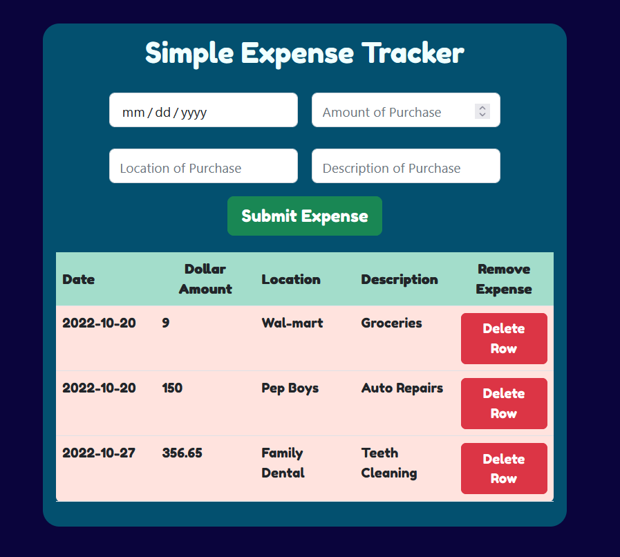

# Simple React Expense Tracker

### Task 7 in the Software Development Mastermind Program

You can use it [here]()

### Summary

Task 7 in Andy Sterkowitz Software Development Mastermind program is to transition from vanilla js into using React, bootstrap, heroku, and local storage. The learning curve can be quite substantial for newer programmers. The program makes use of react states and props in order to create an expense list beneath the form. If an item is deleted, the whole list is filtered and rerendered as an array. There were many challenges for me while writing this program, mainly trying to mentally grasp the concepts of react as a whole. 

### Author

* Elijah C Walker - Systems Engineer/Software Developer